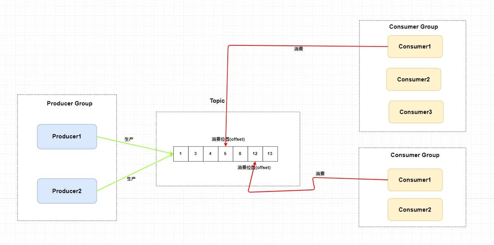

# 
消息队列RocketMQ

# 一. 为什么要用消息队列？

1. 同一个消息，可以由不同的进程同时去处理对应的业务
2. 让上游只关心消息是否发送成功，而不用关心下游具体业务
3. 高流量时，作为一个中间件让下游尽可能处理堆积的消息，而不至于系统不可用

所以，消息队列的作用：

**异步、解耦、削峰**

> **Tips：**
>
> 这三点同时也是系统架构设计中的重点

# 二. 有什么缺点吗

> 比如，本来是用rpc调用的，现在中间加了个消息队列，如果消息队列挂了呢？

- 1.是否会导致 **系统可用性降低** ？

> 若是想保证高可用，是不是要搞集群？

- 2.那么 **系统的复杂度也会随之提高**？

> 亦或者:
>
> 1. 生产者发送消息失败，执行重试后，可能导致产生重复的消息。
> 2. 消费者处理失败了，请求重发，同样也会产生重复的消息。
>
> 对于一些微服务来说，消费重复消息会带来更大的麻烦，比如增加积分。

- 3.如何解决  **重复消费消息的问题** ？

> 如果我们此时的消息需要保证严格的顺序性怎么办呢？
>
> 比如生产者生产了一系列的有序消息(对一个id为1的记录进行删除增加修改)，但是我们知道在发布订阅模型中，对于主题是无顺序的，那么这个时候就会导致对于消费者消费消息的时候没有按照生产者的发送顺序消费，比如这个时候我们消费的顺序为修改删除增加，如果是金融操作的话是不是会出大事情？

- 4.如何解决 **消息的顺序消费问题** ？

> 在同一个系统中我们一般会使用事务来进行业务逻辑异常的处理，但是在不同系统中如何保证事务呢？总不能这个系统我扣钱成功了你那积分系统积分没加吧？或者说我这扣钱明明失败了，你那积分系统给我加了积分。

- 5.如何解决 **分布式事务问题** 呢？

> 我们刚刚说了，消息队列可以进行削峰操作，那如果我的消费者如果消费很慢或者生产者生产消息很快，这样是不是会将大量消息堆积在消息队列中？

- 6.如何解决 **消息堆积的问题** 呢？

# 三. RocketMQ

> 参考：[阿里云RocketMQ官网](https://help.aliyun.com/document_detail/112008.html)

## 1.什么是RocketMQ

先来看看aliyun上对rocketMQ的解释：

消息队列RocketMQ版是阿里云基于Apache RocketMQ构建的低延迟、高并发、高可用、高可靠的分布式消息中间件。

消息队列RocketMQ版既可为分布式应用系统提供异步解耦和削峰填谷的能力，同时也具备互联网应用所需的海量消息堆积、高吞吐、可靠重试等特性。

> 也就是说RocketMQ具有低延迟(高实时)、高并发、高可用、高可靠、分布式等特性。

## 2. RocketMQ中的消息模型

> 消息-订阅模型（类似于设计模式中的观察者模式）

- 生产者集群：用来表示发送消息应用。

  一个生产者集群下包含多个生产者实例，可以是多台机器，也可以是一台机器的多个进程，或者一个进程的多个生产者对象。

  一个生产者集群可以发送多个Topic消息。

  发送分布式事务消息时，如果生产者中途意外宕机，RocketMQ服务端会主动回调生产者集群的任意一台机器来确认事务状态。

- 消费者集群：用来表示消费消息应用。

  一个消费者集群下包含多个消费者实例，可以是多台机器，也可以是多个进程，或者是一个进程的多个消费者对象。

  一个消费者集群下的多个消费者以**均摊方式消费（集群模式）**消息。如果设置的是**广播模式**，那么这个消费者集群下的每个实例都消费全量数据。

  一个消费者集群对应一个Group ID，一个Group ID可以订阅多个Topic，如图中的Group 2所示。

## 3.topic内是怎么样的？

**主题中存在多个队列**，生产者每次生产消息之后是指定主题中的某个队列发送消息的。

每个主题中都有多个队列(分布在不同的 `Broker`中，如果是集群的话，`Broker`又分布在不同的服务器中)，集群消费模式下，一个消费者集群多台机器共同消费一个 `topic` 的多个队列时，**一个队列在同一消费组内只会被一个消费者消费** 。如果某个消费者挂掉，分组内其它消费者会接替挂掉的消费者继续消费。所以一般来讲要控制 **消费者组中的消费者个数和主题中队列个数相同** 。

当然也可以消费者个数小于队列个数，只不过不太建议。

**每个消费组在每个队列上维护一个消费位置** ，为什么呢？

因为我们刚刚画的仅仅是一个消费者组，我们知道在发布订阅模式中一般会涉及到多个消费者组，而每个消费者组在每个队列中的消费位置都是不同的。如果此时有多个消费者组，那么消息被一个消费者组消费完之后是不会删除的(因为其它消费者组也需要呀)，它仅仅是为每个消费者组维护一个 **消费位移(offset)** ，每次消费者组消费完会返回一个成功的响应，然后队列再把维护的消费位移加一，这样就不会出现刚刚消费过的消息再一次被消费了。

可能你还有一个问题，**为什么一个主题中需要维护多个队列** ？

答案是 **提高并发能力** 。的确，每个主题中只存在一个队列也是可行的。你想一下，如果每个主题中只存在一个队列，这个队列中也维护着每个消费者组的消费位置，这样也可以做到 **发布订阅模式** 。如下图。

但是，这样我生产者是不是只能向一个队列发送消息？又因为需要维护消费位置所以一个队列只能对应一个消费者组中的消费者，这样是不是其他的 `Consumer` 就没有用武之地了？从这两个角度来讲，并发度一下子就小了很多。

所以总结来说，`RocketMQ` 通过**使用在一个 `Topic` 中配置多个队列并且每个队列维护每个消费者组的消费位置** 实现了 **主题模式/发布订阅模式** 。

## 4.系统部署架构

### 1.概念

图中所涉及到的概念如下所述：

- **Name Server**：是一个几乎无状态节点，可集群部署，在消息队列RocketMQ版中提供命名服务，更新和发现Broker服务。

    - 简单来说就是 --> **是个注册中心，用来存放Broker路由表 + 管理Broker，并保障高可用（解决Broker集群与生产者/消费者之间的耦合）**

- **Broker**：消息中转角色，负责存储消息，转发消息。分为Master Broker和Slave Broker，一个`Master`可以对应多个`Slave` ，但是一个`Slave `只能对应一

  个`Master` 。Broker启动后需要完成一次将自己注册至Name Server的操作，随后每隔30s定期向Name Server上报Topic路由信息。

    - 简单来说就是 --> **消息队列服务器**

- **生产者**：与Name Server集群中的其中一个节点（随机）建立长连接（Keep-alive），定期从Name Server读取Topic路由信息，并向提供Topic服务的`Master Broker`建立长连接，且定时向`Master Broker`发送心跳。

- **消费者**：与Name Server集群中的其中一个节点（随机）建立长连接，定期从Name Server拉取Topic路由信息，并向提供Topic服务的Master Broker、Slave

  Broker建立长连接，且定时向Master Broker、Slave Broker发送心跳。Consumer既可以从Master Broker订阅消息，也可以从Slave Broker订阅消息，订阅

  规则由Broker配置决定。

> **Tips：**
>
> Topic与Broker是多对多关系
>
> 所以，如果某个Topic消息量很大，应该给它多配置几个队列，并且 **尽量多分布在不同 Broker 上，以减轻某个Broker的压力** 。

### 2.细节

更加具体一点的细节如下：

1. 为了保证高可用 ， `Name Server` 也可以做集群部署，但是它是 **去中心化** 的。也就意味着它没有主节点， `Name Server` 的所有节点是没有进行信息复制的，

   在 `RocketMQ` 中是通过 **单个Broker和所有Name Server保持长连接** ，并且在每隔30秒 `Broker` 会向所有 `Name server` 发送心跳，心跳包含了自身的

   `Topic` 配置信息，这个步骤就对应的就是`Broker`集群与`Name Server`集群间的路由信息。

2. `Broker` **做了集群并且还进行了主从部署** ，由于消息分布在各个 `Broker` 上，一旦某个 `Broker` 宕机，则该`Broker` 上的消息读写都会受到影响。所以

   `Rocketmq` 提供了 `master/slave` 的结构，` salve` 定时从 `master` 同步数据(同步刷盘或者异步刷盘)，如果 `master` 宕机，**则 `slave` 提供消费服务，但是**

   **不能写入消息** 。

3. 在生产者需要向 `Broker` 发送消息的时候，**需要先从 `NameServer` 获取关于 `Broker` 的路由信息**，然后通过 **轮询** 的方法去向每个队列中生产数据以达到 **负载**

   **均衡** 的效果。

4. 消费者通过 `NameServer` 获取所有 `Broker` 的路由信息后，向 `Broker` 发送 `Pull` 请求来获取消息数据。`Consumer` 可以以两种模式启动—— **广播**

   **（Broadcast）和集群（Cluster）**。广播模式下，一条消息会发送给 **同一个消费组中的所有消费者** ；集群模式下，消息只会发送给一个消费者。

## 5.顺序消费

### 1. 概念

> 顺序消费又分为：全局顺序、局部顺序

全局顺序: 也就是严格按照FIFO，消费消息的顺序和产生消息的顺序需要严格保证一致；

局部顺序: 也就是分为一个个的sharding Key，只要保证同一个key下的顺序是一致就可以了，比如一个订单的顺序为生成、付款、完成，那只要关心同样的一个订单ID下消费顺序一致就可以了；

###  2. 实现原理

其实很简单，我们需要处理的仅仅是将同一语义下的消息放入同一个队列(比如这里是同一个订单)，那我们就可以使用 **Hash取模法** 来保证同一个订单在同一个队列中就行了。

## 6.重复消费

就两个字—— **幂等** 。在编程中一个 **幂等** 操作的特点是其任意多次执行所产生的影响均与一次执行的影响相同。

比如说，这个时候我们有一个短信推送系统，每当来一个消息的时候它就负责为对应的手机号推送短信。可是有一次，消息队列发送给短信推送系统了一条消息，其要求给某个手机号推送信息。但是短信推送系统在收到消息处理完成之后，返回消息队列处理成功信息的时候出现了网络波动(当然还有很多种情况，比如Broker意外重启等等)，这条回应没有发送成功。

那么，消息队列没收到短信推送系统的回应会不会尝试重发这个消息？问题就来了，我再发这个消息，万一它又给同一个手机发消息怎么办呢？

所以我们需要给我们的消费者实现 **幂等** ，也就是对同一个消息的处理结果，执行多少次都不变。

那么如何给业务实现幂等呢？这个还是需要结合具体的业务的。你可以使用 **写入 `Redis`** 来保证，因为 `Redis` 的 `key` 和 `value` 就是天然支持幂等的。当然还有使用 **数据库插入法** ，基于数据库的唯一键来保证重复数据不会被插入多条。

不过最主要的还是需要 **根据特定场景使用特定的解决方案** ，你要知道你的消息消费是否是完全不可重复消费还是可以忍受重复消费的，然后再选择强校验和弱校验的方式。毕竟在 CS 领域还是很少有技术银弹的说法。

而在整个互联网领域，幂等不仅仅适用于消息队列的重复消费问题，这些实现幂等的方法，也同样适用于，**在其他场景中来解决重复请求或者重复调用的问题** 。比如将HTTP服务设计成幂等的，**解决前端或者APP重复提交表单数据的问题** ，也可以将一个微服务设计成幂等的，解决 `RPC` 框架自动重试导致的 **重复调用问题** 。

## 7.其他支持的消息

其他还包括`事务消息` `定时、延时消息`。

都是通过维护多个队列进行转换实现的，有兴趣的同学可以去了解一下。

## 8.消息堆积

当大量消息涌入消息队列的时候，也就是生产速度远大于消费速度。这时候就是一开始说的削峰了，策略也有很多：

1. 生产者限流降级生产消息；
2. 消费者批量进行消费；
3. 增加消费者数量；

> 当然，最快速解决消息堆积问题的方法还是增加消费者实例，不过 **同时你还需要增加每个主题的队列数量** 。
>
> 别忘了在 `RocketMQ` 中，**一个队列只会被一个消费者消费** ，如果你仅仅是增加消费者实例就会出现消费者消费不到消息。

## 9.回溯消费

官方的解释为：

回溯消费是指 `Consumer` 已经消费成功的消息，由于业务上需求需要重新消费，在`RocketMQ` 中， `Broker` 在向`Consumer` 投递成功消息后，**消息仍然需要保留** 。并且重新消费一般是按照时间维度，例如由于 `Consumer` 系统故障，恢复后需要重新消费1小时前的数据，那么 `Broker` 要提供一种机制，可以按照时间维度来回退消费进度。`RocketMQ` 支持按照时间回溯消费，时间维度精确到毫秒。

## 10.存储机制

到这里，一开始的六个问题已经解决了。

但是，在 `Topic` 中的 **队列是以什么样的形式存在的？队列中的消息又是如何进行存储持久化的呢？**还未解决，其实这里涉及到了 `RocketMQ` 是如何设计它的存储结构了。也就是 `RocketMQ`消息存储架构中的三大角色——`CommitLog` 、`ConsumeQueue` 和 `IndexFile` 。

- `CommitLog`： **消息主体以及元数据的存储主体**，存储 `Producer` 端写入的消息主体内容,消息内容不是定长的。单个文件大小默认1G ，文件名长度为20位，左边补零，剩余为起始偏移量，比如00000000000000000000代表了第一个文件，起始偏移量为0，文件大小为1G=1073741824；当第一个文件写满了，第二个文件为00000000001073741824，起始偏移量为1073741824，以此类推。消息主要是**顺序写入日志文件**，当文件满了，写入下一个文件。
- `ConsumeQueue`： 消息消费队列（逻辑消费队列），**引入的目的主要是提高消息消费的性能**(我们再前面也讲了)，由于`RocketMQ` 是基于主题 `Topic` 的订阅模式，消息消费是针对主题进行的，如果要遍历 `commitlog` 文件中根据 `Topic` 检索消息是非常低效的。`Consumer` 即可根据 `ConsumeQueue` 来查找待消费的消息。其中，`ConsumeQueue`（逻辑消费队列）**作为消费消息的索引**，保存了指定 `Topic` 下的队列消息在 `CommitLog` 中的**起始物理偏移量 `offset` \**，消息大小 `size` 和消息 `Tag` 的 `HashCode` 值。\**`consumequeue` 文件可以看成是基于 `topic` 的 `commitlog` 索引文件**，故 `consumequeue` 文件夹的组织方式如下：topic/queue/file三层组织结构，具体存储路径为：$HOME/store/consumequeue/{topic}/{queueId}/{fileName}。同样 `consumequeue` 文件采取定长设计，每一个条目共20个字节，分别为8字节的 `commitlog` 物理偏移量、4字节的消息长度、8字节tag `hashcode`，单个文件由30W个条目组成，可以像数组一样随机访问每一个条目，每个 `ConsumeQueue`文件大小约5.72M；
- `IndexFile`： `IndexFile`（索引文件）提供了一种可以通过key或时间区间来查询消息的方法。这里只做科普不做详细介绍。

总结来说，整个消息存储的结构，最主要的就是 `CommitLoq` 和 `ConsumeQueue` 。而 `ConsumeQueue`你可以大概理解为 `Topic` 中的队列

`RocketMQ` 采用的是 **混合型的存储结构** ，即为 `Broker` 单个实例下所有的队列共用一个日志数据文件来存储消息。这就有点类似于我们有一大堆书需要装上书架，`RockeMQ` 是不分书的种类直接成批的塞上去的。

那 `RocketMQ` 为什么要这么做呢？原因是 **提高数据的写入效率** ，不分 `Topic` 意味着我们有更大的几率获取 **成批** 的消息进行数据写入，但也会带来一个麻烦就是读取消息的时候需要遍历整个大文件，这是非常耗时的。

所以，在 `RocketMQ` 中又使用了 `ConsumeQueue` 作为每个队列的索引文件来 **提升读取消息的效率**。我们可以直接根据队列的消息序号，计算出索引的全局位置（索引序号*索引固定⻓度20），然后直接读取这条索引，再根据索引中记录的消息的全局位置，找到消息。

> **参考：**
>
>  [JavaGuide](https://javaguide.cn/high-performance/message-queue/rocketmq-intro.html)
>
> cc个人分享

